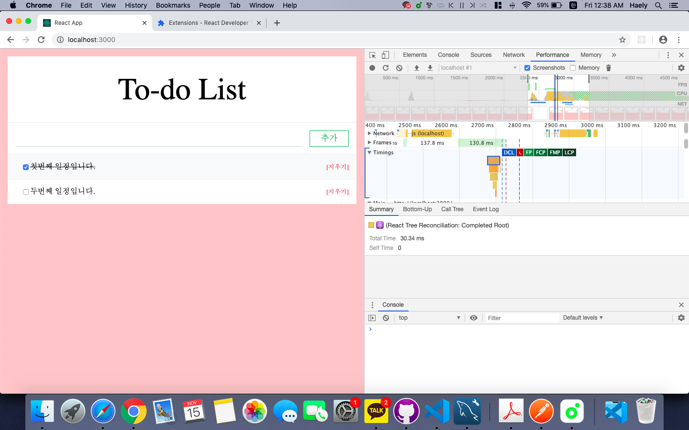
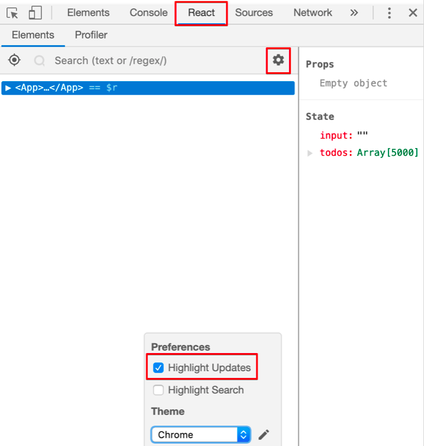
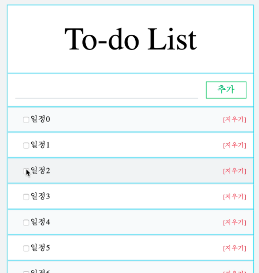

# Rerendering
* 부모 컴포넌트가 리렌더링되면 자식 컴포넌트도 리렌더링
* 그 과정에서 불필요하게 리렌더링 되는 것을 줄이는 최적화!

https://kkiuk.tistory.com/291. => 크롬에서 react debugging tool 설치 방법 (근데 왜 난 안될까..ㅜ)

***
## 1. TodoList 최적화

Performance에서 record(검은 동그라미) 누르고 페이지 새로고침 후 stop 하면 이런식으로 뜬다.

Timings을 보면 걸린 시간을 볼 수 있음.

이 과정을 거치고 나면 컴포넌트마다 하이라이트 박스가 쳐짐. input에 타이핑을 하면 input뿐만 아니라 모든 컴포넌트에 하이라이트가 된다. 즉, 모든 컴포넌트가 리렌더링 됨...! 이를 방지하기 위해 `shouldComponentUpdate`를 사용한다.

input에만 변화가 있었는데 TodoList 전체가 리렌더링 되었다. TodoList는 todos가 변경되었을 때 리렌더링 되어야 함.

~~~javascript
//TodoList.js
class TodoList extends Component{
    shouldComponentUpdate(nextProps, nextState, nextContext){
        return this.props.todos !== nextProps.todos;
    }
~~~

`shouldComponentUpdate`가 false를 리턴하면 렌더링하지 않는다. 위 코드는 todos가 다음 props의 todos와 같지 않을 때 true 리턴, 같을 때 false 리턴이다. 즉, todos가 변경되면 true이므로 렌더링!

다시 performance 측정해보면 더 빨라진 것 확인 가능.

## 2. TodoItem 최적화

토글될 때마다 모든 TodoItem 데이터들이 리렌더링

따라서 TodoItem의 done 값이 다른 것만 렌더링하도록 코드를 추가한다.

~~~javascript
//TodoItem.js
class TodoItem extends Component {
    shouldComponentUpdate(nextProps, nextState, nextContext) {
        return this.props.done !== nextProps.done;
    }
~~~

done값이 다음 props의 done과 다르면 true, 같으면 false를 리턴한다. 즉, 토글되어 이전의 done과 달라졌을 때만 렌더링된다.
