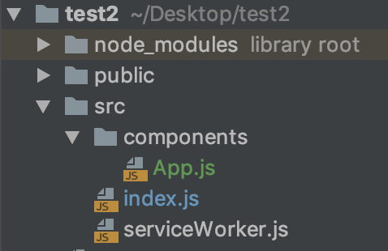
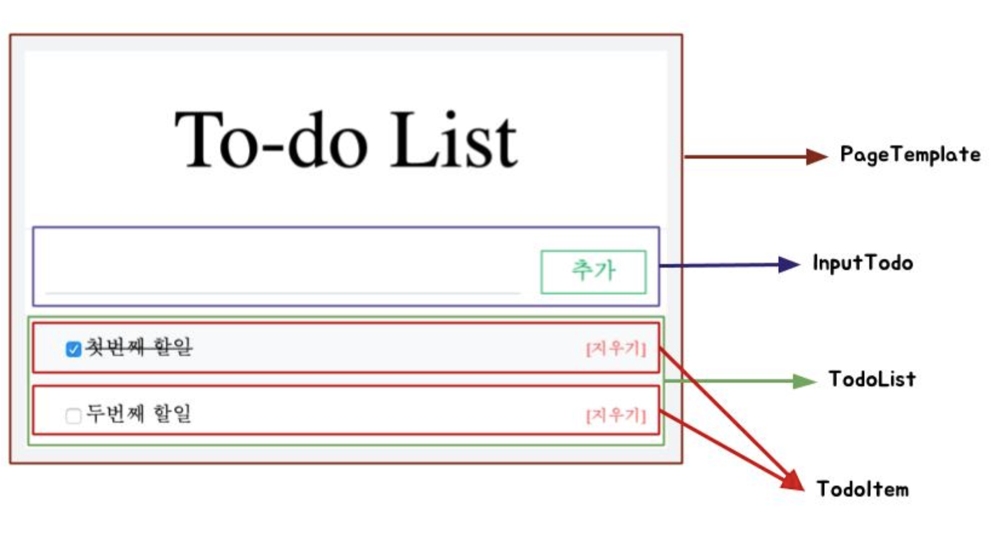
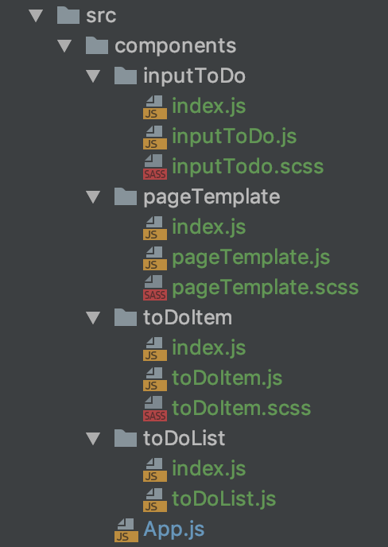

# ToDoList 프로젝트1 (UI, Components 구성)

## todolist react 프로젝트 생성하기
개발을 진행할 디렉토리 경로로 이동한 후 해당 경로에 react 프로젝트 생성  
`create-react-app todo-list` or
`npx create-react-app todo-list`

## 기본 디렉토리 설정
  
src폴더 안에 index.js와 serviceWorker.js, App.js를 제외하고 다 지운 후!  
src폴더 안에 components라는 폴더를 하나 만들어준다.  
/src/components 는 앞으로 모든 컴포턴트를 가지고 있는 디렉토리이다.  
/src/App.js에 있던 App.js파일을 /src/components 안으로 이동시킨다!


## Style 설정
색상을 좀 더 편리하게 사용하기 위해 **open-color**를 다운로드!  
`npm install open-color`  
node-sass 설명추가하기  
`npm install node-sass`  

```scss
/src/styles/main.scss

@import "utils";

body {
  background: $oc-blue-3;
  margin: 0;
}
```

```scss
/src/styles/utils.scss

@import "~open-color/open-color.scss";
```

## 컴포넌트 설정

모든 컴포넌트들을 총관리? 할 /src/components/App.js안에 App 컴포넌트를 생성한다.

```jsx harmony
/src/components/App.js

import React, {Component} from 'react';

class App extends Component {
    render() {
        return (
            <div>
                To-do list
            </div>
        );
    }
}

export default App;
```

위에서 설정한 스타일과 컴포넌트를 로드한다.
```jsx harmony
/src/index.js

import React from 'react';
import ReactDOM from 'react-dom';
import './styles/main.scss';
import App from './components/App';
import * as serviceWorker from './serviceWorker';

ReactDOM.render(<App />, document.getElementById('root'));

serviceWorker.unregister();
```

## 구성할 컴포넌트 설계



#### pageTemplate
pageTemplate 컴포넌트는 UI의 전체 틀을 설정한다.

#### inputToDo
inputToDo는 일정을 추가할때 사용하는 컴포넌트이다. input 폼과 추가 버튼이 있다.

#### toDoItem
toDoItem To-do list의 아이템 하나 하나가 된다.

#### toDoList
toDoList는 데이터를 toDoItem 컴포넌트로 리스트를 만드는 역할을 한다.





#### pageTemplate
```jsx harmony
/src/components/PageTemplate.js
import React, {Component} from 'react';
import styles from './pageTemplate.scss';
import classNames from 'classnames/bind';

const cx = classNames.bind(styles);

class pageTemplate extends Component {
    render() {
        const { children } = this.props
        return (
            <div className={cx('page-template')}>
                <h1>To-do List</h1>
                <div className={cx('content')}>
                    {children}
                </div>
            </div>
        );
    }
};

export default pageTemplate;

```
`import styles from './PageTemplate.scss';` 로 스타일을 import 한뒤 classNames 패키지로 bind한다.  
 그리고 To-do List의 가장 큰 기본틀을 구성하며 { children } 으로 자식요소들을 로드 한다.
 
 ```scss
 /src/components/PageTemplate/PageTemplate.scss
 
 @import "../../styles/utils";
 
 .page-template {
   margin-top: 5rem;
   margin-left: auto;
   margin-right: auto;
   width: 500px;
   background: white;
   box-shadow: 0 3px 6px rgba(0,0,0,0.16), 0 3px 6px, rgba(0,0,0,0.23);
   padding-top: 2rem;
 
   @media (max-width: 768px) {
     margin-top: 1rem;
     width: calc(100% - 2rem);
   }
   h1{
     text-align: center;
     font-size: 4rem;
     font-weight: 300;
     margin: 0;
   }
 
   .content {
     margin-top: 2rem;
   }
 }
 ```
 
 ```jsx harmony
 /src/components/PageTemplate/index.js
 export { default } from './PageTemplate';
 ```
index.js 는 default 소스가 된다.  
따라서 위와 같이 index.js 를 작성해 주면 상위 컴포넌트인 App.js에서 './PageTemplate/PageTemplate.js' 가 아닌 './PageTemplate' 로 import 할 수 있다.

## InputTodo
To-do 를 입력하는 InputTodo 컴포넌트를 만들자.

```jsx harmony
/src/components/InputToto/InputTodo.js

import React, {Component} from 'react';
import styles from './inputTodo.scss';
import classNames from 'classnames/bind';

const cx = classNames.bind(styles);

class inputToDo extends Component{
    render() {
        const { onChange, value, onInsert } = this.props;

        const handleKeyPress = (e) => {
            if(e.key === 'Enter') {
                onInsert();
            }
        };

        return (
            <div className={cx('todo-input')}>
                <input onChange={onChange} value={value} onKeyPress={handleKeyPress}/>
                <div className={cx('add-button')} onClick={onInsert}>추가</div>
            </div>

        );
    }
};

export default inputToDo;

```
이 컴포너트는 props를 3개 받는다.

- value : input 값으로 설정
- onChange : input 내용에 변경이 있을때 사용하는 이벤트
- onInsert : 추가 버튼을 눌렀을 때 실행하는 이벤트  
키보드 Enter 키 입력 이벤트를 위해서 handleKeyPress 메서드도 생성한다.
```scss
/src/components/InputTodo/InputTodo.scss

@import "../../styles/utils";

.todo-input {
  border-top: 1px solid $oc-gray-2;
  border-bottom: 1px solid $oc-gray-2;
  display: flex;
  padding: 1rem;

  input{
    flex: 1;
    font-size: 1.1rem;
    outline: none;
    border: none;
    background: transparent;
    border-bottom: 1px solid $oc-gray-4;
    &:focus {
      border-bottom: 1px solid $oc-cyan-6;
    }
  }

  .add-button {
    width: 5rem;
    height: 2rem;
    margin-left: 1rem;
    border: 1px solid $oc-green-7;
    color: $oc-green-7;
    font-weight: 500;
    font-size: 1.1rem;
    display: flex;
    align-items: center;
    justify-content: center;
    cursor: pointer;
    &:hover {
      background: $oc-green-7;
      color: white;
    }
    &:active {
      background: $oc-green-8;
    }
  }
}
```

```jsx harmony
/src/components/InputTodo/index.js

export { default } from './InputTodo'
```

## TodoItem
일정 정보를 렌더링 하는 TodoItem 컴포넌트이다.

```jsx harmony
/src/components/TodoItem/TodoItem.js

import React, {Component} from 'react';
import styles from './TodoItem.scss';
import classNames from 'classnames/bind';

const cx = classNames.bind(styles);

class TodoItem extends Component {
  render() {
    const {done, children, onToggle, onRemove} = this.props;

    return (
      <div className={cx('todo-item')} onClick={onToggle}>
        <input className={cx('tick')} type="checkbox" checked={done} readOnly/>
        <div className={cx('text', {done})}>{children}</div>
        <div className={cx('delete')} onClick={onRemove}>[지우기]</div>
      </div>
    );
  }
}

export default TodoItem;
```
- done : 해당 일정이 완료했는지 체크
- children : 자식요소 (일정 내용)
- onToggle : 일정 완료/미완료 토글
- onRemove : 해당 일정 삭제

```scss
/src/components/TodoItem/TodoItem.scss

@import "../../styles/utils";

.todo-item {
  padding: 1rem;
  display: flex;
  align-items: center;
  cursor: pointer;
  .tick {
    margin-left: 1rem;
  }
  .text {
    flex: 1;
    word-break: break-all;
    &.done {
      text-decoration: line-through;
    }
  }
  .delete {
    margin-left: 1rem;
    color: $oc-red-7;
    font-size: 0.8rem;
    &:hover {
      color: $oc-red-5;
      text-decoration: underline;
    }
  }
  &:nth-child(odd) {
    background: $oc-gray-0;
  }
  &:hover {
    background: $oc-gray-1;
  }

}

//컴포넌트 사이에 위쪽 테두리를 설정
.todo-item + .todo-item {
  border-top: 1px solid $oc-gray-1;
}
```

```jsx harmony
/src/components/TodoItem/index.js

export { default } from './TodoItem';
```

## TodoList
TodoList 컴포넌트는 데이터 배열을 컴포넌트 배열로 변환하여 렌더링 하는 역할만 한다.  
데이터를 컴포넌트 배열로 변환하는 코드전에 더미 데이터를 넣어 컴포넌트가 정상적으로 렌더링 되는지 테스트 해본다.
```jsx harmony
/src/components/TodoList/TodoList.js

import React, {Component} from 'react';
import TodoItem from '../TodoItem';

class TodoList extends Component {
  render() {
    return (
      <div>
        <TodoItem done>첫번째 할일</TodoItem>
        <TodoItem>두번째 할일</TodoItem>
      </div>
    );
  }
}

export default TodoList;
```

```jsx harmony
src/components/TodoList/index.js
export { default } from './TodoList';
```

```jsx harmony
/src/components/App.js

import React, { Component } from 'react';
import PageTemplate from './PageTemplate';
import InputTodo from './InputTodo';
import TodoList from './TodoList';

class App extends Component {
    render() {
        return (
          <PageTemplate>
              <InputTodo/>
              <TodoList/>
          </PageTemplate>
        );
    }
}

export default App;
```

_**written by 재현**_
